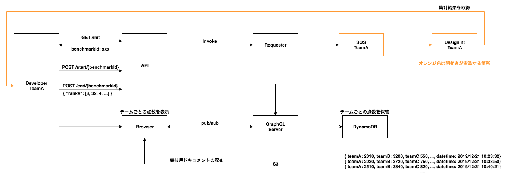

# serverless-workshop



開発者（参加者）は SQS に送信された情報を集計するシステムを構築します。

# アンケート集計システム

「冬といえば何？」というお題に対し、ユーザが回答した項目を集計してください。
CSV 形式で以下のようなファイルが SQS に格納されます。

```
1, クリスマス
2, 雪
3, こたつ
3, こたつ
8, 鍋
1, クリスマス
...
```

SQS に投入されたデータをいち早く集計し、結果をランキングごとに出力できたチームが優勝です。

| 評価項目             | ポイント                                            |
| -------------------- | --------------------------------------------------- |
| 集計までのスピード　 | （60-処理時間）分 × 100 ポイント                    |
| 正確さ　             | 全て正解 5000 ポイント / 一位だけ正解 3000 ポイント |

# 競技用 API

## benchmarkId を取得する

GET http://endpoint/init

```
{
    "benchmarkId": "c30afc91-ffd2-4407-a5ab-15b682753c0c"
}
```

## SQS への投稿を開始する

POST http://endpoint/start

```
{
    "message": "benchmark job has been started.",
    "benchmarkId": "c30afc91-ffd2-4407-a5ab-15b682753c0c"
}
```

## 集計結果を評価する

POST https://endpoint/end/{benchmarkId}

HttpBody

```
{
	"ranks": [1,2,3]
}
```

Response

```
{
    "ranks": [
        1,
        2,
        3
    ],
    "score": 100
}
```
